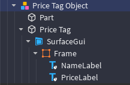

# Modules Overview

This document outlines all the current features included in **CORE Retail Lite**.

## All Features
| Feature Name | Description |
| ----------- | ----------- |
| Proximity To Get System | Take a Product Via ProximityPrompt |
| Restocking System | Restock all products in a shelf |
| Trolley/Basket System | Taken product goes into a Trolley or Basket |
| Price Tag System | Displays Product information like Name and Cost |

## Proximity To Get System

Instead of the conventional Click-To-Get System which is unwieldy for any device other than a computer, we've gone for a Proximity Prompt instead.

ProximityPrompts are easy to use on all devices and lets us display custom text on them.

> [!TIP|style:flat]
> You can setup a custom ProximityPrompt to improve your game see: [Proximity Prompt Customizer](https://devforum.roblox.com/t/proximity-prompt-customizer/1663458)

## Restocking System

The Restocking System allows players to visually see taken products missing from the shelf and allows other players (staff) to restock those missing products.

### Restocking System Objects:

A **Restocking BillboardGui** is parented to the CORE Retail Lite Server Storage Folder which gets parented & enabled to a shelf that requires a restock.

You may customise this **BillBoardGui** to your taste.

> [!NOTE] 
> Additionally a [Configuration Object](https://create.roblox.com/docs/reference/engine/classes/Configuration) can be parented to a shelf which can hold the following objects:
>
> | Object Type | Name | Description |
> | ----------- | ----------- | ----------- |
> | IntValue | MaxProducts | Changes the MaxProducts held of that product from a specific shelf |
> | BoolValue | MustBeStacked | Makes it so products taken come from the highest position first see [examples](examples.md) |

<!-- #### Callbacks
> OnRestock(plr, ShelfName, Shelf)
> 
> Is available in the [Configuration](configuration.md) under "Functions"
>
> This function will fire upon a player restocking a shelf, and comes with a few variables. -->

## Trolley/Basket System

The Trolley/Basket System allows players to visually see products taken from shelves in their own trolley or basket.

More information will be put here soon.

## Price Tag System

The Price Tag System is a Price Tag which displays product information such as Name and Price, a few examples of this is included in the download in the "Examples" folder.

> [!WARNING|style:flat]
> GUI structure and GUI naming MUST stay the same otherwise it will not work

Below is the structure of a typical Price Tag

Available Objects parented to "Frame"

| Object Type | Name | Description |
| ----------- | ----------- | ----------- |
| TextLabel | NameLabel | Displays Product Name |
| TextLabel | CostLabel | Displays Product Cost using the Currency defined in [Configuration](configuration.md) |